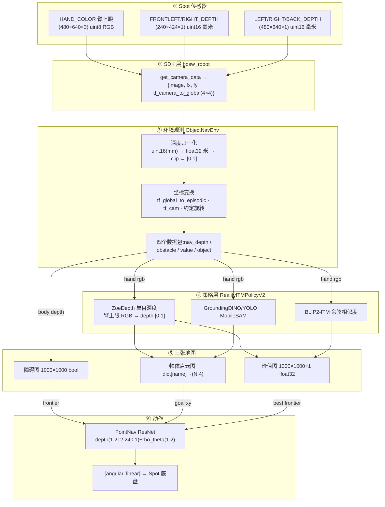

# 08 · Reality(真机)数据格式端到端变化链

> 适用对象:Boston Dynamics **Spot**(BDSW = Boston Dynamics Spot Wrapper)真机路径,代码在 [`vlfm/reality/`](../../vlfm/reality) + [`vlfm/policy/reality_policies.py`](../../vlfm/policy/reality_policies.py)。
> 本文只讲**数据格式**:分辨率、dtype、单位、数值范围、坐标系,以及**每个元素到底代表什么物理含义**(RGB=像素坐标+颜色;深度=像素坐标+距离;点云=xyz;价值图=xy+语义分)。
> 配套既有笔记:[`05_数据形态速查表.md`](05_数据形态速查表.md)(偏仿真)。本文是**真机专版**,补齐臂上眼、Spot 五目、ZoeDepth 单目深度等仿真里没有的环节。

---

## 阅读约定

- **分辨率写法**:传感器规格习惯写 `宽W×高H`;但 numpy 数组实际是 `(H, W, C)`(行在前)。本文两者都标,避免混淆。
- **坐标系**:
  - `像素系` —— (行 v, 列 u),原点在图像左上。
  - `相机系` —— 以相机光心为原点的 3D。
  - `episodic 系` —— 以「本次任务起点」为原点的世界系(x 前、y 左、z 上)。
  - `global/odom 系` —— Spot 上电原点的里程计世界系。
- **关键全局参数**(取自 [`config/experiments/reality.yaml`](../../config/experiments/reality.yaml)):

  | 参数 | 值 | 含义 |
  |---|---|---|
  | `max_body_cam_depth` | 2.5 m | 机身深度相机最大有效距离 |
  | `max_gripper_cam_depth` | 5.0 m | 臂上眼最大有效距离 |
  | `min/max_obstacle_height` | 0.1 / 1.5 m | 障碍高度过滤区间 |
  | `agent_radius` | 0.2 m | 机器人半径(膨胀用) |
  | `depth_image_shape` | (212, 240) | 喂给 PointNav 网络的深度图尺寸 |
  | `pointnav_stop_radius` | 0.9 m | 到目标多近算「到达」 |
  | `max_lin_dist / max_ang_dist` | 0.2 m / 30° | 单步最大平移/转角 |
  | 地图 `pixels_per_meter` / `size` | 20 / 1000 | 5 cm/格,50 m×50 m([`obstacle_map.py:36`](../../vlfm/mapping/obstacle_map.py)) |

---

## Part 0 · 端到端总览



**统一节点表(本文核心原子单元)** —— 链路上每一次格式变化填一行:

| 列 | 含义 |
|---|---|
| 字段 | 代码里的真实变量名 |
| 结构 | ndarray / tuple / dict / Tensor |
| shape | 形状 / 分辨率 |
| dtype | uint8 / uint16 / float32 / bool |
| 单位 · 范围 | 毫米[0,65535] / 米[0,2.5] / 归一[0,1] |
| 坐标系 | 像素 / 相机 / episodic / global |
| **每元素物理含义** | **这个数到底代表什么** |
| 代码 | file:line |

---

## Part 1 · 硬件传感器层(相机清单)

来源:[`camera_ids.py`](../../vlfm/reality/robots/camera_ids.py) 的 `CAM_ID_TO_SHAPE`(其内常量写 `宽×高×通道`)。

| 相机 ID | 角色 | 规格 W×H×C | numpy shape (H,W,C) | dtype | 单位·范围 | 用途 |
|---|---|---|---|---|---|---|
| `HAND_COLOR` | **臂上眼**(手爪 RGB) | 640×480×3 | (480,640,3) | uint8 | [0,255] | 价值图 + 物体检测/分割 |
| `HAND_DEPTH` | 手爪深度 | 224×171×1 | (171,224) | uint16 | 毫米 | **不直接用**(被 ZoeDepth 估计替代) |
| `FRONTLEFT_DEPTH` | 前左深度 | 424×240×1 | (240,424) | uint16 | 毫米 | nav_depth + 障碍图 |
| `FRONTRIGHT_DEPTH` | 前右深度 | 424×240×1 | (240,424) | uint16 | 毫米 | nav_depth + 障碍图 |
| `LEFT/RIGHT/BACK_DEPTH_IN_VISUAL_FRAME` | 侧/后深度 | 640×480×1 | (480,640) | uint16 | 毫米 | 障碍图(仅前 10 步) |
| `*_FISHEYE` | 机身鱼眼灰度 | 640×480×3 | (480,640,3) | uint8 | [0,255] | 本配置注释掉,未用 |

### RGB / Depth / RGBD 到底装了什么(回答你的核心问题)

- **RGB(臂上眼)= 像素坐标 + 颜色,本身没有 3D**。
  每个像素 `(v 行, u 列)` 存一个 `(R, G, B)` 三元组。它告诉你「**画面里什么位置是什么颜色**」,但**不知道那点离相机多远** → 所以 RGB 单独**无法**给出 xyz。
- **Depth(深度)= 像素坐标 + 距离(单通道)**。
  每个像素 `(v, u)` 存一个标量 `z`(到物体的直线距离)。它知道「**多远**」,但不知道颜色。
- **「RGBD」= RGB 与 Depth 对齐叠加** → 每像素同时有 `(R,G,B)` 和 `z`。**有了 z + 相机内参 (fx,fy),才能把 (v,u,z) 反投影成 3D 点 (x,y,z)**,这一步叫**反投影 / unprojection**,见 Part 5.1。
- ⚠️ **真机的反直觉点**:臂上眼**只出 RGB,没有对齐深度**。它的「D」是策略层用 **ZoeDepth 单目模型**临场估计的(Part 4)。而**障碍图用的是机身深度相机的真实深度**,不是臂上眼。两条深度来源必须分清。

---

## Part 2 · 机器人 SDK 层(`bdsw_robot.py`)

[`get_camera_data(srcs)`](../../vlfm/reality/robots/bdsw_robot.py) 对每个相机返回一个 dict:

| 字段 | 结构 | shape | dtype | 含义 | 来源 |
|---|---|---|---|---|---|
| `image` | ndarray | (H,W[,C]) | uint8/uint16 | 原始图像 | `image_response_to_cv2` |
| `fx` | float | 标量 | float | x 方向焦距(像素) | `response.source.pinhole.intrinsics.focal_length.x` |
| `fy` | float | 标量 | float | y 方向焦距(像素) | 同上 `.y` |
| `tf_camera_to_global` | ndarray | (4,4) | float64 | 相机系→global 的齐次变换 | `transforms_snapshot` |

- **内参 fx/fy**:针孔模型焦距,单位「像素」。决定反投影时 `x=(u-W/2)·z/fx`,以及 FOV `= 2·atan((W/2)/fx)`([`geometry_utils.py:239`](../../vlfm/utils/geometry_utils.py))。
- **外参 tf**:4×4 齐次矩阵,左上 3×3 是旋转、右上 3×1 是平移(米)。
- 机身位姿 `xy_yaw → ([x,y] 米, yaw 弧度)`,取自 `spot.get_xy_yaw(use_boot_origin=True)`(global/odom 系)。
- 臂关节 `arm_joints → (6,) 弧度`。

---

## Part 3 · 环境观测层(`ObjectNavEnv._get_camera_obs`)

[`objectnav_env.py:131`](../../vlfm/reality/objectnav_env.py)。这里做三件事:深度归一化、坐标变换、打四个数据包。

### 3.1 深度归一化链(`_norm_depth`,[`pointnav_env.py:135`](../../vlfm/reality/pointnav_env.py))

```
uint16 原始(毫米)
   │  .astype(float32)
   ▼
float32(毫米)
   │  / 1000.0           # 毫米 → 米
   ▼
float32(米)
   │  clip(0, max_depth) / max_depth   # 归一化
   ▼
float32 ∈ [0, 1]         # 喂给后续所有模块的标准深度
```

- 机身相机 `max_depth = 2.5 m`,臂上眼 `= 5.0 m`。
- 归一化后**丢失了绝对尺度**,所以后续用到时必须用 `scaled = depth·(max−min)+min` 反算回米(Part 5 反复出现)。
- 额外滤波:`filter_depth`(`depth_camera_filtering`)去噪;`fill_small_holes` 补洞([`img_utils.py:361`](../../vlfm/utils/img_utils.py))。

### 3.2 坐标变换链(每个相机)

[`objectnav_env.py:139`](../../vlfm/reality/objectnav_env.py):

```
tf = tf_global_to_episodic @ tf_camera_to_global      # 相机 → episodic
tf = tf @ rotation_matrix                              # 相机光学约定 → 机器人 xyz 约定
   其中 rotation_matrix = [[0,-1,0,0],
                           [0, 0,-1,0],
                           [1, 0, 0,0],
                           [0, 0, 0,1]]
```

- `rotation_matrix` 把相机光学系(x 右、y 下、z 前)重排成机器人系(x 前、y 左、z 上)。
- 结果 `tf_camera_to_episodic` 是后续点云从相机系搬到 episodic 系的关键。

### 3.3 四个数据包(env → policy 的真正接口)

| 数据包 | 结构 | 每元素元组 | RGB 来源 | 深度来源 | min/max | 去向 |
|---|---|---|---|---|---|---|
| `nav_depth` | ndarray | — | — | 前左+前右深度拼接 | (机身2.5) | PointNav |
| `obstacle_map_depths` | List[tuple] | `(depth, tf, min, max, fx, fy, fov)` | — | 机身深度(前10步含侧后) | 0 / 2.5 | 障碍图 |
| `value_map_rgbd` | List[tuple] | `(rgb, depth, tf, min, max, fov)` | 臂上眼 | 占位 ones(后 ZoeDepth) | 0 / 5.0 | 价值图 |
| `object_map_rgbd` | List[tuple] | `(rgb, depth, tf, min, max, fx, fy)` | 臂上眼 | 占位 ones(后 ZoeDepth) | 0 / 5.0 | 物体图 |

- **`nav_depth`**:`hstack(前右, 前左)` 两路前置深度旋转至竖直后左右拼接 → 单通道 float32 [0,1];`filter_depth(set_black_value=1.0)`。进 PointNav 前再 resize 到 `(212,240)`。
- **`obstacle_map_depths` 最后一项 depth=None**:那是臂上眼,只用来更新「已探索区域」,不贡献障碍点。
- **前 10 步用全部 5 个机身深度相机**(360° 建图),之后只用前左/前右两个([`objectnav_env.py:187`](../../vlfm/reality/objectnav_env.py))。
- **GPS/Compass**:`robot_xy (2,) 米 episodic`(x 前 y 左)、`robot_heading float 弧度`(yaw,逆时针)。

---

## Part 4 · 策略层(`RealityITMPolicyV2`)

[`reality_policies.py`](../../vlfm/policy/reality_policies.py) + [`base_objectnav_policy.py`](../../vlfm/policy/base_objectnav_policy.py) + [`itm_policy.py`](../../vlfm/policy/itm_policy.py)。

### 4.1 ZoeDepth 单目深度估计(臂上眼的「D」从哪来)

- 模型:`torch.hub.load("isl-org/ZoeDepth", "ZoeD_NK")`([`reality_policies.py:40`](../../vlfm/policy/reality_policies.py))。
- 触发条件:`object_map_rgbd` 里的占位深度是全 1,且当前帧**检测到物体**时,才用 `_infer_depth(rgb)` 估一张真深度替换([`base_objectnav_policy.py:675`](../../vlfm/policy/base_objectnav_policy.py))。

| 字段 | 结构 | shape | dtype | 单位·范围 | 含义 |
|---|---|---|---|---|---|
| 输入 `rgb` | ndarray | (480,640,3) | uint8 | [0,255] | 臂上眼 RGB |
| 输出 `depth` | ndarray | (480,640) | float32 | [0,1] | 单目估计深度(已 `clip(min,max)/(max−min)`) |

### 4.2 观测缓存(`_cache_observations`)

- 把 `obstacle_map_depths` 逐个喂进 `ObstacleMap.update_map` → 产出 `frontiers (N,2) 米`。
- `nav_depth` → `torch.from_numpy` reshape 成 `(1, H, W, 1)` 上 cuda。
- 缓存 `robot_xy (2,)`、`robot_heading float`、`object_map_rgbd`、`value_map_rgbd`。

### 4.3 三条感知支路(都吃臂上眼 RGB)

| 支路 | 模型 | 输入 | 输出 | 代码 |
|---|---|---|---|---|
| 物体检测 | GroundingDINO(非COCO)/ YOLOv7(COCO) | rgb (H,W,3) uint8 + caption | `ObjectDetections` | [`base_objectnav_policy.py:436`](../../vlfm/policy/base_objectnav_policy.py) |
| 实例分割 | MobileSAM | rgb + bbox[x1,y1,x2,y2] 像素 | bool mask (H,W) | [`sam.py:40`](../../vlfm/vlm/sam.py) |
| 语义打分 | BLIP2-ITM | rgb + prompt 文本 | cosine float | [`blip2itm.py:37`](../../vlfm/vlm/blip2itm.py) |

`ObjectDetections`([`detections.py:15`](../../vlfm/vlm/detections.py)):

| 字段 | 结构 | shape | 含义 |
|---|---|---|---|
| `boxes` | Tensor | (N,4) | 框,xyxy,**归一化 [0,1]**(用时 ×[W,H,W,H] 还原像素) |
| `logits` | Tensor | (N,) | 置信度 [0,1] |
| `phrases` | List[str] | N | 类别词 |

---

## Part 5 · 三张地图的构建(核心)

### 5.1 障碍图 `ObstacleMap`([`obstacle_map.py`](../../vlfm/mapping/obstacle_map.py))

**这是「RGBD 建障碍图」的真实链路**(深度→点云→俯视栅格):

```
depth [0,1] (H,W)
  │ fill_small_holes
  │ scaled = depth·(max−min)+min        → 米
  │ mask = scaled < max_depth
  ▼
get_point_cloud(scaled, mask, fx, fy)   # 反投影,geometry_utils.py:216
  │   v,u = where(mask); z = depth[v,u]
  │   x = (u − W/2)·z/fx ;  y = (v − H/2)·z/fy
  │   cloud = stack(z, −x, −y)          → 相机系 (N,3) 米
  ▼
transform_points(tf_cam_to_episodic, cloud)   → episodic 系 (N,3) 米
  │ 按高度过滤 [0.1, 1.5] m(filter_points_by_height)
  ▼
xy_points = cloud[:, :2]                # 取俯视 xy
pixel = _xy_to_px(xy)                    # 米→像素,×20,base_map.py:35
self._map[py, px] = 1                    # 占据
```

| 字段 | 结构 | shape | dtype | 含义 |
|---|---|---|---|---|
| `_map` | ndarray | (1000,1000) | **bool** | 该格是否被障碍占据 |
| `_navigable_map` | ndarray | (1000,1000) | bool | 障碍按机器人半径膨胀后取反 = 可走 |
| `explored_area` | ndarray | (1000,1000) | bool | 已探索(fog-of-war 射线揭示) |
| `frontiers` | ndarray | (N,2) | float | 已知/未知边界点,**米,episodic** |

- 栅格分辨率 **5 cm/格**;`point_cloud_episodic_frame` 每行 = 一个障碍点的 `(x, y, z)`。
- frontier 由 `detect_frontier_waypoints` 在 navigable∩explored 边界提取,再 `_px_to_xy` 转回米。

### 5.2 价值图 `ValueMap`([`value_map.py`](../../vlfm/mapping/value_map.py))

| 字段 | 结构 | shape | dtype | 含义 |
|---|---|---|---|---|
| `_value_map` | ndarray | (1000,1000,**1**) | float32 | 每格的语义价值(对找目标多有用) |
| `_map`(置信度) | ndarray | (1000,1000) | float32 | 每格观测置信度 [0,1] |

链路([`itm_policy.py:191`](../../vlfm/policy/itm_policy.py) `_update_value_map`):

```
values = BLIP2ITM.cosine(臂上眼rgb, "Seems like there is a <目标> ahead.")   # float, 1 通道
ValueMap.update_map(values, depth, tf, min, max, fov):
   _process_local_data: 用 depth+fov 算出可见扇形(FOV 锥)置信度掩码
   按相机 yaw 旋转,贴到相机像素位置
   _fuse_new_data: 与历史按「最大置信度 / 加权平均」融合
```

- `value_channels = len(text_prompt.split("|"))`,本配置单 prompt → **1**。
- 选边界:`sort_waypoints(frontiers, 0.5)` 在每个 frontier 半径内取价值,降序 → 最优探索方向([`itm_policy.py:263`](../../vlfm/policy/itm_policy.py))。

### 5.3 物体点云图 `ObjectPointCloudMap`([`object_point_cloud_map.py`](../../vlfm/mapping/object_point_cloud_map.py))

```
detections.boxes ×[W,H,W,H] → 像素框 → MobileSAM → object_mask (H,W) bool
depth(ZoeDepth 估计) + mask → get_point_cloud → 相机系 (N,3)
  │ get_random_subarray(5000) ;(真机关闭 DBSCAN)
transform_points(tf) → episodic (N,3)
拼接 within_range 标志列 → (N,4)
```

| 字段 | 结构 | shape | 含义 |
|---|---|---|---|
| `clouds[name]` | ndarray | (N,4) | 列 0-2 = 物体点 `(x,y,z)` 米 episodic;列 3 = 是否在可信距离内的标记 |
| `get_best_object()` | ndarray | (2,) | 目标的最近可信点 `(x,y)` 米 → 导航目标 |

---

## Part 6 · 目标点导航(PointNav)

[`pointnav_policy.py`](../../vlfm/policy/utils/pointnav_policy.py) + [`base_objectnav_policy.py:458`](../../vlfm/policy/base_objectnav_policy.py)。

**输入观测**:

| 字段 | 结构 | shape | dtype | 单位·范围 | 含义 |
|---|---|---|---|---|---|
| `depth` | Tensor | (1,212,240,1) | float32 | [0,1] | 前置拼接深度,resize 到 depth_image_shape |
| `pointgoal_with_gps_compass` | Tensor | (1,2) | float32 | (米, 弧度) | `rho`=到目标距离,`theta`=需左转角度 |

`rho_theta(robot_xy, heading, goal)`([`geometry_utils.py:9`](../../vlfm/utils/geometry_utils.py)):把目标的世界 xy 转成「我要走多远、左转多少」。

**输出动作**(ResNet+LSTM 策略):

| 形态 | shape | 含义 |
|---|---|---|
| 真机(连续) | (1,2) | `[angular, linear]` ∈ [-1,1] |

→ `RealityMixin.act` 解成 `{"angular":…, "linear":…}`([`reality_policies.py:69`](../../vlfm/policy/reality_policies.py))
→ `pointnav_env.step`:`clip[-1,1]·max_dist`(0.2 m / 30°)→ `spot.set_base_position(x_pos, y_pos=0, yaw)`。

> 初始化阶段动作不是底盘速度,而是 `arm_yaw`:用机械臂把臂上眼依次摆到 `[-90°…90°]` 扫一圈环视([`reality_policies.py:16`](../../vlfm/policy/reality_policies.py))。

---

## Part 7 · 精度 / 格式陷阱专章(你说的「精度」)

> 「精度」= 数据精度:**位深(uint8/uint16/float32/bool)、单位(毫米 vs 米)、数值范围、坐标约定**。链路上每次踩坑几乎都在这。

| # | 陷阱 | 细节 |
|---|---|---|
| 1 | **毫米 ↔ 米** | 传感器原始深度是 uint16 **毫米**;`/1000` 才是米。漏除 → 距离放大 1000 倍。 |
| 2 | **uint16 → float32 → [0,1]** | 归一化后**丢绝对尺度**,任何要用米的地方必须 `·(max−min)+min` 反算。 |
| 3 | **不同相机不同 max_depth** | 机身 2.5 m、臂上眼 5.0 m;反算尺度时别用错常量。 |
| 4 | **W×H ↔ (H,W,C)** | `CAM_ID_TO_SHAPE` 写宽×高;numpy 是行×列。fx 配宽、fy 配高,搞反 FOV/点云全歪。 |
| 5 | **深度图旋转 270°** | `SHOULD_ROTATE`(前左/前右/手爪深度)需旋正才竖直;nav_depth 依赖这步。 |
| 6 | **相机光学系 → 机器人 xyz** | env 里乘 `rotation_matrix`,`get_point_cloud` 又输出 `(z,−x,−y)`;两处约定叠加,改任一处都要同步。 |
| 7 | **episodic ↔ global** | 策略全程用 episodic(起点为原点);Spot 底层用 global/odom。`tf_global_to_episodic` 是桥。 |
| 8 | **检测框归一化 [0,1]** | `boxes` 是归一化 xyxy,喂 SAM/反投影前要 `×[W,H,W,H]` 还原像素。 |
| 9 | **臂上眼无真深度** | 它的「D」是 ZoeDepth 估计,精度弱于机身 ToF;故障碍图坚持用机身深度。 |
| 10 | **bool vs float 地图** | 障碍图 `_map` 是 bool(占据与否);价值图 `_value_map` 是 float32(连续分)。语义完全不同。 |

---

## Part 8 · 附录:每个节点「信息含义」对照表

| 数据 | 维度本质 | 每元素装了什么 | 能否直接给 3D |
|---|---|---|---|
| RGB 图 | 2D + 颜色 | (行 v, 列 u) → (R,G,B) | ❌ 无距离 |
| Depth 图 | 2D + 距离 | (行 v, 列 u) → z(米) | ❌ 需配 fx,fy 反投影 |
| RGBD(对齐) | 2D + 颜色 + 距离 | (v,u) → (R,G,B,z) | ✅ 反投影后得 (x,y,z) |
| 相机系点云 | 3D | 每行 (z,−x,−y) 米,相机为原点 | ✅ 已是 xyz |
| episodic 点云 | 3D | 每行 (x,y,z) 米,起点为原点 | ✅ 世界 xyz |
| 障碍栅格 | 2D 俯视 | (格行, 格列) → 占据 bool | 投影掉了 z |
| 价值图 | 2D 俯视 + 语义 | (格行, 格列) → 语义分 float | 投影掉了 z |
| 物体点云 | 3D + 标志 | (x,y,z, 可信标志) | ✅ |
| rho_theta | 极坐标 | (距离米, 转角弧度) | 1D 导航量 |
| 动作 | 控制量 | (angular, linear) ∈ [-1,1] | — |

---

### 关键文件索引

| 层 | 文件 |
|---|---|
| 相机定义 | [`vlfm/reality/robots/camera_ids.py`](../../vlfm/reality/robots/camera_ids.py) |
| SDK | [`vlfm/reality/robots/bdsw_robot.py`](../../vlfm/reality/robots/bdsw_robot.py) |
| 环境观测 | [`vlfm/reality/objectnav_env.py`](../../vlfm/reality/objectnav_env.py)、[`pointnav_env.py`](../../vlfm/reality/pointnav_env.py) |
| 策略 | [`vlfm/policy/reality_policies.py`](../../vlfm/policy/reality_policies.py)、[`base_objectnav_policy.py`](../../vlfm/policy/base_objectnav_policy.py)、[`itm_policy.py`](../../vlfm/policy/itm_policy.py) |
| 几何 | [`vlfm/utils/geometry_utils.py`](../../vlfm/utils/geometry_utils.py) |
| 地图 | [`vlfm/mapping/obstacle_map.py`](../../vlfm/mapping/obstacle_map.py)、[`value_map.py`](../../vlfm/mapping/value_map.py)、[`object_point_cloud_map.py`](../../vlfm/mapping/object_point_cloud_map.py) |
| VLM | [`vlfm/vlm/grounding_dino.py`](../../vlfm/vlm/grounding_dino.py)、[`blip2itm.py`](../../vlfm/vlm/blip2itm.py)、[`sam.py`](../../vlfm/vlm/sam.py)、[`detections.py`](../../vlfm/vlm/detections.py) |
| PointNav | [`vlfm/policy/utils/pointnav_policy.py`](../../vlfm/policy/utils/pointnav_policy.py) |
| 入口/配置 | [`vlfm/reality/run_bdsw_objnav_env.py`](../../vlfm/reality/run_bdsw_objnav_env.py)、[`config/experiments/reality.yaml`](../../config/experiments/reality.yaml) |
