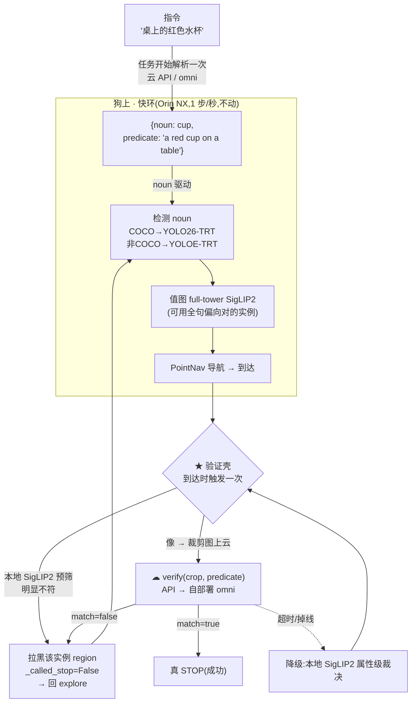

# 14 · 属性 / 关系 Instance-Nav 升级方案: 找名词 → 到达 → 云侧二次判断

> 日期:2026-06-17
>
> **一句话**:VLFM 热循环(检测→值图→PointNav,1 步/秒)**一行不动**;只在终点 STOP **之前**套一个"验证壳",把"是不是红色的 / 是不是在桌上"这类**属性 / 关系**判断**离线到云**做一次。云初期用 API,后期换自部署 / 训练的 omni 大模型,**藏在同一个 `verify(crop, predicate)` 接口后**,下游零改动。
>
> **前提 / 边界**:端侧硬件账见 [13_硬件端侧部署评估.md](13_硬件端侧部署评估.md)(狗 = AiMe,起步 Jetson Orin NX 16GB);检测 / SAM / 值图数据形态见 [02_YOLO_Grounding_SAM_对象定位.md](02_YOLO_Grounding_SAM_对象定位.md)、[05_数据形态速查表.md](05_数据形态速查表.md);决策流程见 [04_决策流程_act_explore_navigate.md](04_决策流程_act_explore_navigate.md);ITM 后端见 [11_SigLIP2_ITM_可回滚替换方案.md](11_SigLIP2_ITM_可回滚替换方案.md)。

---

## 14.0 结论先行

1. **可行,且这是 v1 的正确形态。** 不要"换个更强的开放词检测器"去硬解属性——那是治不好的(见 §14.1)。正解是**二阶段**:检测器只管找**名词**(椅子 / 杯子),属性 / 关系交给会组合推理的 VLM,在**到达目标那一刻**判一次。
2. **唯一侵入式改动 = 在 STOP 处加"验证 + 拒绝 + 拉黑实例 + 继续探索"的壳。** 它在热循环**之外**,不拖慢 1 步/秒。范式直接抄现成的 `_act_multi_goal`(到达→裁决→可撤销 STOP→重派)。
3. **云只在"到达点"被叫一次**(最坏情况每个同名实例一次,用本地预筛压下去)。机器人本来就停着,等 1-2s 无感。
4. **接口冻死** `verify(crop_rgb, predicate) -> {match: bool, reason: str}`。API → 自部署 omni 只换后端,policy / 检测 / 值图全不动。
5. **显存代价**:开放词逼着值图的 SigLIP2 从 edge-lean 查表(666 MiB)切 full-tower(~1214 MiB),**+~548 MiB**,记到 [13](13_硬件端侧部署评估.md) 的账上(无 RGB-D 4378→~4926;有 RGB-D 2202→~2750)。Orin NX 16GB 扛得住,8GB 板要掂量。

---

## 14.1 为什么不是"换个更强的开放词检测器"

GroundingDINO / YOLO-World / YOLOE 这类开放词检测器,文本端都是 CLIP 式对比编码,有被反复证实的**"词袋"问题**:"red chair" 被拆成"红"+"椅子"分别匹配,**不会把属性绑到那个物体上**。画面里白椅子 + 红墙,它照样给高分。

**当前远端的 SigLIP2 也是同一类**(全局对比双塔):它对**整张裁剪图**出一个向量、对**整句话**出一个向量,只能算 cosine。所以:

- **简单属性(颜色 / 材质)**:SigLIP2 能做"**打分式**确认"(`cosine(crop,"red chair")` vs `cosine(crop,"white chair")` 取大),**够用、+0 模型**。这条留作端侧预筛 + 掉线降级。
- **关系 / 组合 / 计数**("桌**上**的杯子"、"红桌子**旁边**那把椅子"、"**第二层**架子"):双塔结构上做不了——它没有"谁在谁旁边"的概念,喂整句关系话只会**制造假阳性**。**这才需要生成式 VLM(云侧 omni)**,它能"先定位红桌子→找旁边的椅子→带依据回 yes/no"。

> 你举的两个 v1 例子里,"桌上水杯"**已经是空间关系**了。所以"找名词→到达→验关系"这套对属性型和关系型**是同一条路**,不用分两套。

---

## 14.2 整体数据流



**精神**:狗上那条 `DET→VMAP→NAV` 是现在就有的热循环,**原样不动**;新增的只有 `SHELL`(验证壳)和它后面的 `REJECT`(拉黑),都挂在"到达"这一个事件上。

---

## 14.3 分阶段方案

每个 Phase 都能独立验证,热循环全程不变。

### Phase 0 — 开放词值图打底(纯配置,0 行新代码)

- **问题**:值图文本是运行时拼的(`itm_policy.py` 里 `text = self._text_prompt.replace("target_object", self._target_object)`)。开放词目标 → 任意句子 → edge-lean 查表**命中不了**,`siglip2itm.py` 会主动报错("prompt not in text table ... Set SIGLIP_TEXT_ENGINE")。
- **做法**:启动脚本加一档形态开关(类比现有 `ITM_BACKEND`):`SIGLIP_FORM=full` 时设 `SIGLIP_TEXT_ENGINE`、**撤掉** `SIGLIP_TEXT_TABLE`,让文本塔现场编码任意句子。
- **交付**:`launch_vlm_servers_jy.sh` 多一档;一条 smoke:目标 `"red chair"`,值图正常出热力图、不报 KeyError。
- **代价**:+~548 MiB(666→1214),进 [13](13_硬件端侧部署评估.md) 的账。

### Phase 1 — 指令解析 + 名词驱动检测

- **做法**:
  - 任务开始**调一次** API/omni 解析指令 → `{noun, predicate}`。失败兜底取末位名词。
  - `noun` 喂现成 `_target_object`,驱动检测 + 值图;`predicate` 存着留给验证壳。
  - 可选:值图文本用**全句**,让探索偏向对的实例(省后面的云调用次数)。
  - 检测器:**COCO 名词(chair/cup)走现成 YOLO26-TRT,真不动**;非 COCO 名词在狗上加 **YOLOE-TRT**(跑现有 `yolo_trt` env;GroundingDINO 在 Orin NX 上 ~2-5 FPS 太慢,见 [13](13_硬件端侧部署评估.md))——**收敛在检测 server 内的替换,不碰 policy**。
- **交付**:带属性/关系的指令进来,VLFM 按名词正常找、导航、STOP(此时**还没有**属性判断),行为同现状。

### Phase 2 — STOP 验证壳 + 拒绝/拉黑(核心新代码,全在热循环外)

详见 §14.4 的伪码。要点:

- 到达(`_called_stop` 因抵达目标置真)→ 取目标裁剪图 → 本地 SigLIP2 预筛 → 像则上云 → `match` 则真停、否则**拉黑该实例 region + 撤销 STOP + 回 explore**。
- **新增** `ObjectPointCloudMap.reject_region(name, xy, R)`,并让 `update_map` 跳过落入拒绝区的新点(否则下一帧重新观测又把白椅子加回来)。
- **交付**:狗 / 仿真里走到白椅子→判否→拉黑→走到红椅子→停。先用**本地桩验证器**(SigLIP2 打分)端到端跑通,不依赖云。

### Phase 3 — 云侧二次判断接入(API → omni)

- **做法**:实现 `AttributeVerifierClient.verify(crop_rgb, predicate)`(同 `server_wrapper` HTTP 范式)。后端先接云 API;**到达点同步调用 + 超时(~3s)**(机器人停着,可以等),超时/掉线 → 退回 Phase 2 的本地 SigLIP2 属性级裁决。后期后端换自部署 omni,**接口不变**。
- **隐私/带宽**:只传 SAM 抠出的目标小裁剪 JPEG(几十 KB),非全帧。
- **交付**:全链路接真云;断网演练证明优雅降级。

---

## 14.4 具体改动点(文件 / 函数 / 签名 / 伪码)

> 行号为落盘时快照,以函数名为准。

### (a) 验证客户端 — 新文件 `vlfm/vlm/attribute_verifier.py`

```python
# 示意,非可运行
class AttributeVerifierClient:
    def __init__(self, port: int = 12186):
        self.url = f"http://localhost:{port}/verify"
    def verify(self, crop_rgb: np.ndarray, predicate: str, timeout: float = 3.0) -> Optional[dict]:
        # 返回 {"match": bool, "reason": str};超时/异常返回 None(交给上层降级)
        try:
            return send_request(self.url, image=crop_rgb, predicate=predicate)  # {"match":..,"reason":..}
        except Exception:
            return None
```

后端 server 初期内部转调云 API;后期换成本地 omni——**对 client 透明**。

### (b) object map 拉黑 — 改 `vlfm/mapping/object_point_cloud_map.py`

```python
# 示意
def reset(self):
    self.clouds = {}
    self._rejected = {}                      # name -> [(xy, radius), ...]

def reject_region(self, name, xy, radius=0.5):
    self._rejected.setdefault(name, []).append((np.asarray(xy), radius))
    if name in self.clouds:                  # 删掉已存的该实例点
        d = np.linalg.norm(self.clouds[name][:, :2] - xy, axis=1)
        self.clouds[name] = self.clouds[name][d > radius]

def _in_rejected(self, name, xy):            # update_map 里加点前先查
    for c, r in self._rejected.get(name, []):
        if np.linalg.norm(np.asarray(xy) - c) <= r:
            return True
    return False
```

`update_map` 加点前若质心落入 `_in_rejected` 则跳过。

### (c) 验证壳 — 改 `vlfm/policy/base_objectnav_policy.py`

`act()` 的 `goal is not None`(navigate)分支末尾插桩:

```python
# 示意
elif goal is not None:
    mode = "navigate"
    pointnav_action = self._navigate_to(goal[:2], observations, conservative=False)
    if self._called_stop and self._predicate:           # 到达了且这次目标带谓词
        alt = self._verify_on_arrival(observations, robot_xy)
        if alt is not None:                              # 判否 → 改吐 explore 动作
            mode, pointnav_action = "verify-reject", alt

def _verify_on_arrival(self, observations, robot_xy):
    crop = self._crop_target(observations)               # 用 _object_masks / 最近检测框裁
    if self._siglip_prefilter(crop, self._predicate) == "clearly_no":
        return self._reject_and_continue(observations)   # 本地直接拒,不叫云
    res = self._verifier.verify(crop, self._predicate)   # 云
    if res is None:                                      # 超时/掉线降级
        res = self._siglip_attribute_decision(crop, self._predicate)
    if res["match"]:
        return None                                      # 保持 _called_stop=True → 真停
    return self._reject_and_continue(observations)

def _reject_and_continue(self, observations):
    self._object_map.reject_region(self._target_object, self._last_goal, R=0.5)
    self._called_stop = False
    self._reset_per_goal_nav()                           # 清 _global_path/_last_goal,现成方法
    return self._explore(observations)                   # 这一步改吐探索动作
```

> 真机上 STOP 只是"我到了"、非终止,所以"判否→继续"天然成立。Habitat eval 里 STOP 终止 episode——所以**在发 STOP 之前**拦截(上面的写法正是如此:`_called_stop` 虽置真但还没 return,被 `_reject_and_continue` 撤销)。

---

## 14.5 可能坑 & 对应解法

| # | 坑 | 触发 | 解法 |
|---|---|---|---|
| 1 | 拒绝后**扭头锁回同一把椅子**(死循环 / 误报成功) | object map 还存着它 | `reject_region` 删点 + 登记拒绝区,`update_map` 跳过该区(§14.4b 核心) |
| 2 | Habitat eval 里 **STOP 是终止动作**,停后没法续 | 仿真评测 | 在**发 STOP 之前**拦截裁决(§14.4c);真机 STOP 本就非终止 |
| 3 | 同名物体多 → 云**被叫 N 次** + 机器人真走到每个错的 | 5 把椅子 1 把红 | ①值图全句驱动先撞对的;②停车前本地 SigLIP2 预筛,明显不符不叫云;③单 episode 云调用设上限 |
| 4 | **名词抽错**("把手红的杯子"抽成"把手") | 解析脆 | 用 API/omni 解析(本来就要调一次),兜底取末位名词 |
| 5 | 开放词目标喂 edge-lean 查表 → **KeyError** | Phase 0 没切 | 切 full-tower(Phase 0);8GB 板紧时退路 = 预烤常用属性词进表 |
| 6 | 云往返时机器人**僵住** / 网络抖动超时 | 弱网 | 单次到达点调用,停着等 1-2s 可接受;超时 → 本地属性级降级 |
| 7 | 检测器 `filter_by_class` **精确匹配吞多词短语** | 开放词 | **名词驱动检测绕开它**(属性不进检测器);名词本身多词再加模糊匹配 |
| 8 | **停车帧目标不在视野**(贴太近 / 角度偏)→ 裁不到图 | 到达瞬间 | 用"最近一次有检测的帧"缓存的裁剪;或停车前先朝目标转一下再裁 |
| 9 | 验证器换后端时**下游被牵动** | API→omni | `verify(crop,predicate)` 签名冻死,只换 server 实现 |
| 10 | 量化 / 换检测器后**置信分布变**,旧阈值失准 | YOLOE / INT8 | 名词检测阈值在目标板上重标;属性判断走 VLM 不吃 cosine 阈值 |

---

## 14.6 显存 / 延迟账(与 13 衔接)

- **端侧只多 ~548 MiB**(SigLIP2 666→1214,Phase 0)。验证 VLM **不在端侧账内**(离线到云)。本地预筛复用已常驻的 SigLIP2,**+0 模型**。
- 对 [13](13_硬件端侧部署评估.md) 的合计:无 RGB-D 4378→**~4926 MiB**,有 RGB-D 2202→**~2750 MiB**。结论不变:Orin NX 16GB 起步舒服,8GB 板要分时 / 低频。
- **延迟**:热循环不受影响(验证不在循环里)。到达点一次云往返 ≈ 裁剪上传(WiFi 几十 ms)+ 云推理(0.3-1.5s)+ 回传 ≈ **0.5-2s**,机器人停着等,体感无。

---

## 14.7 交付物清单 & 验收

| Phase | 交付物 | 验收 |
|---|---|---|
| 0 | 启动脚本 full-tower 档 | `"red chair"` 目标值图正常、不报 KeyError |
| 1 | 指令解析 → `{noun,predicate}`;非COCO 名词 YOLOE 服务 | 带属性指令进来,VLFM 按名词正常找/停(无属性判断) |
| 2 | `reject_region` + 验证壳 + 本地桩验证器 | 走到白椅子→判否→拉黑→走到红椅子→停(纯本地,不依赖云) |
| 3 | `AttributeVerifierClient` + 云 API 后端 + 降级 | 全链路接真云;断网演练降级为属性级 |

> 测试照 [vlfm-dev-test-env]:`vlfm_pip` env + `PYTHONPATH=.`,无 pytest 就写可跑 smoke 脚本;行宽 120。

---

## 14.8 范围边界(本方案**不做**)

- **不做真·实例身份**(两把都是红椅子里找"特定那一把")——object map 按名词聚类,需 per-instance 跟踪,另立项。
- **不改** PointNav / 值图 / 探索热循环的逻辑本身。
- **不在狗上跑生成式 VLM**(关系推理一律离线;Jetson Thor 另说)。

---

## 14.9 一句话汇报短版

> 属性 / 关系导航不靠"换更强的检测器"(词袋问题治不好),而是二阶段:端侧 VLFM 照常用名词快速找物(1 步/秒不变),到达目标那一刻把裁剪图发云侧 VLM 判一次"是不是红的 / 在不在桌上",不符就拉黑该实例继续找。云只在到达点被叫一次,初期 API、后期换自部署 omni,接口不变。端侧仅多约 548 MiB(值图 SigLIP2 切 full-tower 以支持开放词),验证模型不占端侧显存。
